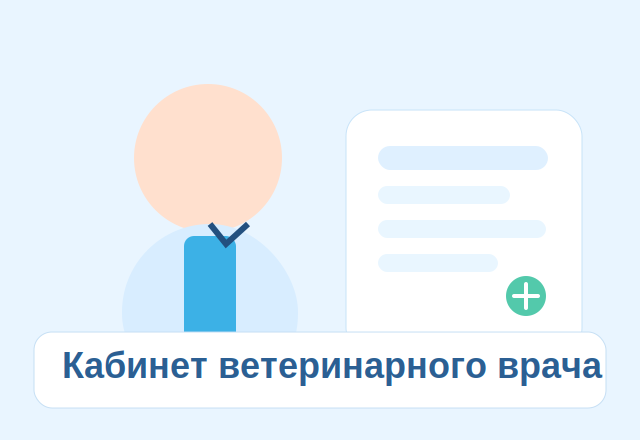
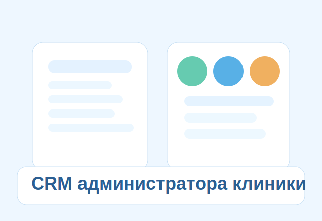

# Lapka MVP Monorepo

Lapka is a veterinary digital ecosystem MVP.

## Release Candidate Snapshot

- RC version: `RC1`
- Date: `2026-03-07`
- Root release note: [`RELEASE_NOTES.md`](./RELEASE_NOTES.md)
- Release notes: [`docs/release_notes_rc1.md`](./docs/release_notes_rc1.md)
- Module catalog: [`docs/modules.md`](./docs/modules.md)

## Installation (Release Candidate)

Prerequisites:

- Docker + Docker Compose
- `curl` + `jq` for API smoke checks

Run stack:

```bash
cd /Users/vadimpetrov/Documents/New\ project/lapka
docker compose up --build -d
```

Stop stack:

```bash
docker compose down
```

Backend seed rerun (idempotent):

```bash
docker compose exec api python -m src.seed
```

## Demo Credentials

| Role | Email | Password |
|---|---|---|
| owner | `owner@lapka.local` | `demo12345` |
| vet | `vet@lapka.local` | `demo12345` |
| clinic_admin | `admin@lapka.local` | `demo12345` |

## Architecture Overview

Lapka is a monorepo with three main runtime layers:

1. `frontend/` — Next.js App Router UI (marketing + owner/vet/clinic apps)
2. `backend/` — FastAPI API with RBAC, consent checks, audit logging, seeded demo data
3. `postgres` (via docker compose) — persistence for auth, medical data, CRM, marketplace, billing

Cross-cutting rules:

- RBAC: `owner`, `vet`, `clinic_admin`
- Consent-scoped access for medical records
- Audit logging for sensitive actions
- AI safety guard for owner-facing interactions (no treatment instructions)

## Modules Overview

- Backend domain routes: [`backend/src/api/routes`](./backend/src/api/routes)
- Frontend route modules: [`frontend/app`](./frontend/app)
- Verified structure snapshot: [`docs/project_structure.md`](./docs/project_structure.md)
- Full module documentation: [`docs/modules.md`](./docs/modules.md)
- Documentation index: [`docs/README.md`](./docs/README.md)

## Structure

- `backend/` FastAPI + PostgreSQL backend
- `frontend/` Next.js App Router frontend (marketing + owner + vet + clinic apps)
- `database/` DB notes
- `ai/` AI architecture notes
- `infrastructure/` infra notes
- `docs/` product docs

## Exact Commands To Run

```bash
cd /Users/vadimpetrov/Documents/New\ project/lapka
docker compose up --build
```

Run in background:

```bash
docker compose up --build -d
```

After frontend updates, do a hard refresh in browser (`Cmd+Shift+R` on macOS) to clear cached CSS/JS.

Stop:

```bash
docker compose down
```

Re-run seed manually:

```bash
docker compose exec api python -m src.seed
```

## URLs

- Backend health: `http://localhost:8000/health`
- Swagger: `http://localhost:8000/docs`
- System metrics: `http://localhost:8000/api/v1/system/metrics`
- Frontend landing: `http://localhost:3000/`
- About: `http://localhost:3000/about`
- For owners: `http://localhost:3000/for-owners`
- For vets: `http://localhost:3000/for-vets`
- For clinics: `http://localhost:3000/for-clinics`
- Map: `http://localhost:3000/map`
- Security: `http://localhost:3000/security`
- Pricing: `http://localhost:3000/pricing`
- FAQ: `http://localhost:3000/faq`
- Owner app: `http://localhost:3000/owner/dashboard`
- Owner pets: `http://localhost:3000/owner/pets`
- Owner appointments: `http://localhost:3000/owner/appointments`
- Owner marketplace: `http://localhost:3000/owner/market`
- Owner clinic profile (example): `http://localhost:3000/owner/clinic/11111111-1111-1111-1111-111111111111`
- Owner vet profile (example): `http://localhost:3000/owner/vet/33333333-3333-3333-3333-333333333333`
- Owner pharmacy: `http://localhost:3000/owner/pharmacy`
- Owner drug details (example): `http://localhost:3000/owner/drugs/drug_0001`
- Owner pet card (Барсик): `http://localhost:3000/owner/pet/55555555-5555-5555-5555-555555555555`
- Vet app: `http://localhost:3000/vet/dashboard`
- Vet appointments: `http://localhost:3000/vet/appointments`
- Vet patients: `http://localhost:3000/vet/patients`
- Vet drugs: `http://localhost:3000/vet/drugs`
- Vet drug details (example): `http://localhost:3000/vet/drugs/drug_0001`
- Clinic app: `http://localhost:3000/clinic/dashboard`
- Clinic schedule: `http://localhost:3000/clinic/schedule`
- Clinic audit + review moderation: `http://localhost:3000/clinic/audit`
- Clinic check-in dashboard: `http://localhost:3000/clinic/checkin`
- Vet visit workspace (example): `http://localhost:3000/vet/visit/66666666-6666-6666-6666-666666666666`
- Owner discharge records (Барсик): `http://localhost:3000/owner/pet/55555555-5555-5555-5555-555555555555/records`
- Owner booking wizard route: `http://localhost:3000/owner/appointments/new`
- Public prescription token page: `http://localhost:3000/public-rx/{token}`

## Production Readiness (Offline / PWA / Backups / AI)

### PWA + offline-first

- PWA manifest: `http://localhost:3000/manifest.webmanifest`
- Service worker: `http://localhost:3000/sw.js`
- Offline fallback page: `http://localhost:3000/offline.html`
- В role-кабинетах добавлены:
  - `Offline mode` banner
  - локальная очередь изменений (IndexedDB) для мутаций, поддерживающих офлайн-очередь
  - синхронизация очереди после восстановления сети
  - `Global search` + `Command palette` (`Ctrl/Cmd + K`)

### Backup / restore

Сделать разовый backup:

```bash
cd /Users/vadimpetrov/Documents/New\ project/lapka
docker compose --profile backup up -d backup
sleep 5
ls -la backups/db
docker compose --profile backup stop backup
```

Restore из дампа:

```bash
DB_HOST=localhost DB_PORT=5432 DB_NAME=lapka DB_USER=lapka DB_PASSWORD=lapka \
bash scripts/restore_db.sh /absolute/path/to/backups/db/lapka_YYYYMMDD_HHMMSS.sql.gz
```

### Safe AI endpoints for vets

```bash
API=http://localhost:8000
VET_TOKEN=$(curl -s -X POST "$API/api/v1/auth/login" \
  -H "Content-Type: application/json" \
  -d '{"email":"vet@lapka.local","password":"demo12345"}' | jq -r '.access_token')

curl -s -X POST "$API/api/v1/ai/visit-structure" \
  -H "Authorization: Bearer $VET_TOKEN" \
  -H "Content-Type: application/json" \
  -d '{"transcript_text":"Пациент Барсик. Жалобы: вялость и снижение аппетита.","patient_id":"55555555-5555-5555-5555-555555555555"}'

curl -s -X POST "$API/api/v1/ai/lab-explain" \
  -H "Authorization: Bearer $VET_TOKEN" \
  -H "Content-Type: application/json" \
  -d '{"lab_text":"ALT выше референса, умеренный лейкоцитоз.","species":"кот"}'
```

## Clinic Visit Journey (8-step demo walkthrough)

1. Owner logs in and opens booking wizard: `/owner/appointments/new`
2. Owner creates appointment (pet + clinic + service + slot + confirm)
3. Admin opens reception dashboard `/clinic/checkin` and performs check-in
4. Check-in creates visit draft linked to appointment
5. Vet opens workspace `/vet/visit/{id}`, starts visit and fills structured protocol tabs
6. Vet finalizes visit, exports owner-safe PDF, and generates tokenized public Rx link
7. Owner opens `/owner/pet/{id}/records`, sees discharge summary, notifications, and opens public prescriptions
8. Admin opens `/clinic/audit` and verifies key events: check-in, visit start/finalize, PDF export, public link create/view/revoke

### Journey curl examples

```bash
API=http://localhost:8000
CLINIC_ID=11111111-1111-1111-1111-111111111111
PET_ID=55555555-5555-5555-5555-555555555555
VISIT_ID=66666666-6666-6666-6666-666666666666
```

#### 1) Login (owner / vet / clinic_admin)

Vets and clinic admins may supply a `clinic_id` during login; the returned
access token will carry the claim and subsequent requests use that clinic
implicitly (no need to pass `?clinic_id=` in the URL).

```bash
OWNER_TOKEN=$(curl -s -X POST "$API/api/v1/auth/login" \
  -H "Content-Type: application/json" \
  -d '{"email":"owner@lapka.local","password":"demo12345"}' | jq -r '.access_token')

VET_TOKEN=$(curl -s -X POST "$API/api/v1/auth/login" \
  -H "Content-Type: application/json" \
  -d '{"email":"vet@lapka.local","password":"demo12345","clinic_id":"'$CLINIC_ID'"}' \
  | jq -r '.access_token')

ADMIN_TOKEN=$(curl -s -X POST "$API/api/v1/auth/login" \
  -H "Content-Type: application/json" \
  -d '{"email":"admin@lapka.local","password":"demo12345","clinic_id":"'$CLINIC_ID'"}' \
  | jq -r '.access_token')
```

If a user is a member of multiple clinics they may also obtain a scoped token
later using the `/api/v1/auth/select-clinic` endpoint:

```bash
RAW=$(curl -s -X POST "$API/api/v1/auth/login" \
  -H "Content-Type: application/json" \
  -d '{"email":"vet@lapka.local","password":"demo12345"}' | jq -r '.access_token')
SCOPED=$(curl -s -X POST "$API/api/v1/auth/select-clinic" \
  -H "Authorization: Bearer $RAW" \
  -H "Content-Type: application/json" \
  -d '{"clinic_id":"'$CLINIC_ID'"}' | jq -r '.access_token')
```

#### 2) Owner creates appointment

```bash
APPOINTMENT_ID=$(curl -s -X POST "$API/api/v1/appointments" \
  -H "Authorization: Bearer $OWNER_TOKEN" \
  -H "Content-Type: application/json" \
  -d "{\"clinic_id\":\"$CLINIC_ID\",\"pet_id\":\"$PET_ID\",\"vet_id\":\"33333333-3333-3333-3333-333333333333\",\"service_type\":\"Консультация\",\"scheduled_at\":\"2026-03-10T10:00:00Z\",\"duration_minutes\":30,\"visit_type\":\"clinic_visit\"}" \
  | jq -r '.id')
```

#### 3) Admin reception check-in (appointment -> visit draft)

```bash
curl -s -X POST "$API/api/v1/appointments/$APPOINTMENT_ID/checkin" \
  -H "Authorization: Bearer $ADMIN_TOKEN"
```

#### 4) Vet starts and finalizes visit

```bash
curl -s -X POST "$API/api/v1/visits/$VISIT_ID/start" \
  -H "Authorization: Bearer $VET_TOKEN"

curl -s -X POST "$API/api/v1/visits/$VISIT_ID/finalize" \
  -H "Authorization: Bearer $VET_TOKEN" \
  -H "Content-Type: application/json" \
  -d '{"owner_summary":"Состояние стабилизировано. Наблюдение дома и контрольный визит.","follow_up_note":"Запишитесь на повторный осмотр в течение 3-5 дней."}'
```

#### 5) Generate public prescription link and fetch token page

```bash
PUBLIC_TOKEN=$(curl -s -X POST "$API/api/v1/public-links/prescription" \
  -H "Authorization: Bearer $VET_TOKEN" \
  -H "Content-Type: application/json" \
  -d "{\"visit_id\":\"$VISIT_ID\",\"pet_id\":\"$PET_ID\",\"expires_in_hours\":24}" \
  | jq -r '.token')

curl -s "$API/api/v1/public/prescriptions/$PUBLIC_TOKEN"
```

#### 6) Revoke public link

```bash
curl -s -X POST "$API/api/v1/public-links/$PUBLIC_TOKEN/revoke" \
  -H "Authorization: Bearer $VET_TOKEN"
```

#### 7) PDF export (auth required)

```bash
curl -i -s "$API/api/v1/visits/$VISIT_ID/export/pdf"

curl -i -s "$API/api/v1/visits/$VISIT_ID/export/pdf" \
  -H "Authorization: Bearer $OWNER_TOKEN"
```

#### 8) Owner notifications and admin audit

### Dark theme support
The frontend now includes a **dark mode** toggle (button at bottom‑right of the screen).
Clicking it cycles between light, dark and system preferences; the choice is
persisted in `localStorage` and the UI uses Tailwind `dark:` variants.


```bash
curl -s "$API/api/v1/notifications?limit=50" \
  -H "Authorization: Bearer $OWNER_TOKEN"

curl -s "$API/api/v1/audit?limit=100" \
  -H "Authorization: Bearer $ADMIN_TOKEN"
```

## UI Preview





## Demo Credentials

Password for all users: `demo12345`

- owner: `owner@lapka.local`
- vet: `vet@lapka.local`
- clinic_admin: `admin@lapka.local`

## Quick Login From UI

1. Open `http://localhost:3000/`
2. Нажмите `Войти` (dropdown) или откройте `http://localhost:3000/login`
3. Выберите роль (`owner` / `vet` / `clinic_admin`) и выполните логин
4. После логина произойдёт переход на dashboard роли
5. В topbar отображается текущий пользователь (`email + role`) и доступна кнопка `Выйти`
6. Если пользователь не авторизован, страницы `/owner/*`, `/vet/*`, `/clinic/*` редиректят на `/login`
7. Если роль не соответствует странице, происходит редирект на dashboard корректной роли
8. If you see API error in app integrations, run:

```bash
docker compose up --build -d
```

## Seed Constants (for demo calls)

- `clinic_id`: `11111111-1111-1111-1111-111111111111`
- `pet_id (Барсик)`: `55555555-5555-5555-5555-555555555555`
- `visit_id (Барсик)`: `66666666-6666-6666-6666-666666666666`
- public prescription token: `barsik-public-link`
- public document token: `barsik-public-doc`

## Demo dataset verification

The seed is deterministic (`SEED=2026`) and idempotent.  
Summary file is generated inside API container:

```bash
docker compose exec -T api cat storage/seed_summary.json
```

Extract sample IDs (FULL_RECORD / BASIC_MEDICAL / NO_CONSENT):

```bash
SUMMARY_JSON=$(docker compose exec -T api cat storage/seed_summary.json)
FULL_PET_ID=$(echo "$SUMMARY_JSON" | jq -r '.sample_entities.full_record_pet.pet_id')
BASIC_PET_ID=$(echo "$SUMMARY_JSON" | jq -r '.sample_entities.basic_medical_pet.pet_id')
NO_CONSENT_PET_ID=$(echo "$SUMMARY_JSON" | jq -r '.sample_entities.no_consent_pet.pet_id')
```

Verification curls:

```bash
API=http://localhost:8000
CLINIC_ID=11111111-1111-1111-1111-111111111111

OWNER_TOKEN=$(curl -s -X POST "$API/api/v1/auth/login" \
  -H "Content-Type: application/json" \
  -d '{"email":"owner@lapka.local","password":"demo12345"}' | jq -r '.access_token')

VET_TOKEN=$(curl -s -X POST "$API/api/v1/auth/login" \
  -H "Content-Type: application/json" \
  -d '{"email":"vet@lapka.local","password":"demo12345"}' | jq -r '.access_token')

# owner sees only own pets
curl -s "$API/api/v1/pets" -H "Authorization: Bearer $OWNER_TOKEN"

# vet can open pet with FULL_RECORD consent -> 200
curl -i -s "$API/api/v1/pets/$FULL_PET_ID?clinic_id=$CLINIC_ID" \
  -H "Authorization: Bearer $VET_TOKEN"

# vet can open pet with BASIC_MEDICAL consent -> 200 (basic access)
curl -i -s "$API/api/v1/pets/$BASIC_PET_ID?clinic_id=$CLINIC_ID" \
  -H "Authorization: Bearer $VET_TOKEN"

# vet cannot open pet without consent -> 403
curl -i -s "$API/api/v1/pets/$NO_CONSENT_PET_ID?clinic_id=$CLINIC_ID" \
  -H "Authorization: Bearer $VET_TOKEN"

# upcoming appointments (next 14 days demo dataset)
NOW=$(date -u +"%Y-%m-%dT%H:%M:%SZ")
IN_14_DAYS=$(date -u -v+14d +"%Y-%m-%dT%H:%M:%SZ" 2>/dev/null || python3 - <<'PY'
from datetime import datetime, timedelta, timezone
print((datetime.now(timezone.utc) + timedelta(days=14)).strftime("%Y-%m-%dT%H:%M:%SZ"))
PY
)
curl -s --get "$API/api/v1/appointments" \
  -H "Authorization: Bearer $VET_TOKEN" \
  --data-urlencode "clinic_id=$CLINIC_ID" \
  --data-urlencode "date_from=$NOW" \
  --data-urlencode "date_to=$IN_14_DAYS" \
  --data-urlencode "mine=false" | jq '. | length'
```

### Clinic-grade patient search (masked until consent)

New endpoints:

- `GET /api/v1/owner/search/pets?q=`
- `GET /api/v1/clinic/search/patients?q=&mode=&clinic_id=`
- `POST /api/v1/consent-requests`
- `GET /api/v1/owner/requests`
- `POST /api/v1/owner/requests/{request_id}/approve`
- `POST /api/v1/owner/requests/{request_id}/reject`
- `POST /api/v1/clinic/checkin/qr`

Demo flow (vet search -> masked -> request consent -> owner approve -> full card):

```bash
API=http://localhost:8000
CLINIC_ID=11111111-1111-1111-1111-111111111111

VET_TOKEN=$(curl -s -X POST "$API/api/v1/auth/login" \
  -H "Content-Type: application/json" \
  -d '{"email":"vet@lapka.local","password":"demo12345"}' | jq -r '.access_token')

OWNER_TOKEN=$(curl -s -X POST "$API/api/v1/auth/login" \
  -H "Content-Type: application/json" \
  -d '{"email":"owner41@lapka.local","password":"demo12345"}' | jq -r '.access_token')

BARSIK_QR_TOKEN=$(docker compose exec -T api cat storage/seed_summary.json | jq -r '.sample_entities.barsik_qr_token')

# 1) vet searches pet with no consent by chip_id -> masked card
curl -s --get "$API/api/v1/clinic/search/patients" \
  -H "Authorization: Bearer $VET_TOKEN" \
  --data-urlencode "clinic_id=$CLINIC_ID" \
  --data-urlencode "mode=chip_id" \
  --data-urlencode "q=LPK-CHIP-00091"

# 2) vet creates consent request
REQUEST_ID=$(curl -s -X POST "$API/api/v1/consent-requests" \
  -H "Authorization: Bearer $VET_TOKEN" \
  -H "Content-Type: application/json" \
  -d '{"master_pet_id":"60136ddf-8327-5875-8e39-2f336b1d9708","clinic_id":"11111111-1111-1111-1111-111111111111","requested_scope":"BASIC_MEDICAL","message":"Нужен доступ для приема."}' \
  | jq -r '.id')

# 3) owner approves request
curl -s -X POST "$API/api/v1/owner/requests/$REQUEST_ID/approve" \
  -H "Authorization: Bearer $OWNER_TOKEN" \
  -H "Content-Type: application/json" \
  -d '{"decision_note":"Подтверждаю доступ для клиники."}'

# 4) vet opens full pet card -> 200
curl -i -s "$API/api/v1/pets/60136ddf-8327-5875-8e39-2f336b1d9708" \
  -H "Authorization: Bearer $VET_TOKEN"

# 5) QR check-in (minimal card only, no full medical record)
curl -s -X POST "$API/api/v1/clinic/checkin/qr" \
  -H "Authorization: Bearer $VET_TOKEN" \
  -H "Content-Type: application/json" \
  -d "{\"token\":\"$BARSIK_QR_TOKEN\",\"clinic_id\":\"11111111-1111-1111-1111-111111111111\"}"
```

## curl Examples (5 end-to-end MVP flows)

### Shared variables

```bash
API=http://localhost:8000
CLINIC_ID=11111111-1111-1111-1111-111111111111
BARSIK_PET_ID=55555555-5555-5555-5555-555555555555
```

### Flow 1: Owner login -> list pets -> upload document -> see in list

```bash
OWNER_TOKEN=$(curl -s -X POST "$API/api/v1/auth/login" \
  -H "Content-Type: application/json" \
  -d '{"email":"owner@lapka.local","password":"demo12345"}' \
  | jq -r '.access_token')

curl -s "$API/api/v1/pets" \
  -H "Authorization: Bearer $OWNER_TOKEN"

curl -s -X POST "$API/api/v1/documents/upload" \
  -H "Authorization: Bearer $OWNER_TOKEN" \
  -H "Content-Type: application/json" \
  -d "{\"pet_id\":\"$BARSIK_PET_ID\",\"clinic_id\":\"$CLINIC_ID\",\"doc_type\":\"blood_test\",\"file_ref\":\"uploads/barsik-owner-upload.pdf\"}"

curl -s "$API/api/v1/documents?pet_id=$BARSIK_PET_ID" \
  -H "Authorization: Bearer $OWNER_TOKEN"
```

### Flow 2: Owner grants consent -> revokes consent -> who has access

```bash
CONSENT_ID=$(curl -s -X POST "$API/api/v1/consents" \
  -H "Authorization: Bearer $OWNER_TOKEN" \
  -H "Content-Type: application/json" \
  -d "{\"pet_id\":\"$BARSIK_PET_ID\",\"clinic_id\":\"$CLINIC_ID\",\"scope_level\":\"FULL_RECORD\"}" \
  | jq -r '.id')

curl -s "$API/api/v1/consents" \
  -H "Authorization: Bearer $OWNER_TOKEN"

curl -s -X POST "$API/api/v1/consents/$CONSENT_ID/revoke" \
  -H "Authorization: Bearer $OWNER_TOKEN"

curl -s "$API/api/v1/consents" \
  -H "Authorization: Bearer $OWNER_TOKEN"
```

### Flow 3: Vet login -> open Барсик with consent -> create visit -> finalize visit

```bash
VET_TOKEN=$(curl -s -X POST "$API/api/v1/auth/login" \
  -H "Content-Type: application/json" \
  -d '{"email":"vet@lapka.local","password":"demo12345"}' \
  | jq -r '.access_token')

curl -s "$API/api/v1/pets/$BARSIK_PET_ID?clinic_id=$CLINIC_ID" \
  -H "Authorization: Bearer $VET_TOKEN"

VISIT_ID=$(curl -s -X POST "$API/api/v1/visits" \
  -H "Authorization: Bearer $VET_TOKEN" \
  -H "Content-Type: application/json" \
  -d "{\"pet_id\":\"$BARSIK_PET_ID\",\"clinic_id\":\"$CLINIC_ID\",\"chief_complaint\":\"Контрольный осмотр\",\"exam_findings\":\"Состояние стабильное\",\"plan_note\":\"Повторный контроль\"}" \
  | jq -r '.id')

curl -s -X POST "$API/api/v1/visits/$VISIT_ID/finalize" \
  -H "Authorization: Bearer $VET_TOKEN" \
  -H "Content-Type: application/json" \
  -d '{"owner_summary":"Состояние стабильно, требуется плановый контроль.","follow_up_note":"Контрольный визит через 3-5 дней."}'
```

### Flow 4: Public QR (create -> open by token -> revoke -> verify inaccessible)

```bash
PUBLIC_TOKEN=$(curl -s -X POST "$API/api/v1/public-links/prescription" \
  -H "Authorization: Bearer $VET_TOKEN" \
  -H "Content-Type: application/json" \
  -d "{\"visit_id\":\"$VISIT_ID\",\"pet_id\":\"$BARSIK_PET_ID\",\"expires_in_hours\":24}" \
  | jq -r '.token')

curl -s "$API/api/v1/public/prescriptions/$PUBLIC_TOKEN"

curl -s -X POST "$API/api/v1/public-links/$PUBLIC_TOKEN/revoke" \
  -H "Authorization: Bearer $VET_TOKEN"

curl -i -s "$API/api/v1/public/prescriptions/$PUBLIC_TOKEN"
```

### Flow 5: Audit (admin sees key events)

```bash
ADMIN_TOKEN=$(curl -s -X POST "$API/api/v1/auth/login" \
  -H "Content-Type: application/json" \
  -d '{"email":"admin@lapka.local","password":"demo12345"}' \
  | jq -r '.access_token')

curl -s "$API/api/v1/audit?limit=200" \
  -H "Authorization: Bearer $ADMIN_TOKEN"
```

### Admin self-service clinic endpoints

```bash
curl -s "$API/api/v1/clinics/me" \
  -H "Authorization: Bearer $ADMIN_TOKEN"

curl -s "$API/api/v1/clinics/me/members" \
  -H "Authorization: Bearer $ADMIN_TOKEN"
```

Expected actions in audit after running these flows:

- `auth.login`
- `consent.grant` and `consent.revoke`
- `document.upload`, `document.view`, `document.download`
- `visit.create` and `visit.finalize`
- `public_link.create`, `public_link.view`, `public_link.revoke`

### Map module demo API (owner/vet/admin authenticated)

```bash
curl -s "$API/api/v1/places?type=clinic" \
  -H "Authorization: Bearer $OWNER_TOKEN"

curl -s --get "$API/api/v1/places" \
  --data-urlencode "type=pharmacy" \
  --data-urlencode "q=Vet" \
  -H "Authorization: Bearer $OWNER_TOKEN"

curl -s --get "$API/api/v1/places" \
  --data-urlencode "type=park" \
  --data-urlencode "city=Москва" \
  -H "Authorization: Bearer $OWNER_TOKEN"
```

## Medication Finder (Owner + Vet)

1. Login as owner: `http://localhost:3000/login`
2. Open `http://localhost:3000/owner/pharmacy`
3. Search by drug name, filter species / form / Rx
4. Click `Все о препарате` for full card + analogs + variants
5. Click `Где купить` to open availability drawer (Online / Nearby offline)
6. Click `В список покупок` to save owner shopping list item
7. Login as vet and open `http://localhost:3000/vet/drugs` for the same flow with clinical notes and `Добавить в визит`

### Demo provider architecture

- Active provider: `PHARMACY_PROVIDER=demo`
- Adapters folder: `backend/src/integrations/pharmacy_providers/`
- Interfaces:
  - `base.py` → provider contract
  - `demo_provider.py` → seeded offers/inventory
  - `provider_registry.py` → provider switch by env
- To add real integrations later: implement a new adapter with the same interface and set `PHARMACY_PROVIDER=<new_provider>`.

### Medication Finder API examples

```bash
API=http://localhost:8000

OWNER_TOKEN=$(curl -s -X POST "$API/api/v1/auth/login" \
  -H "Content-Type: application/json" \
  -d '{"email":"owner@lapka.local","password":"demo12345"}' \
  | jq -r '.access_token')

curl -s --get "$API/api/v1/drugs" \
  --data-urlencode "q=Препарат 1" \
  --data-urlencode "species=кошки" \
  --data-urlencode "form=таблетки" \
  --data-urlencode "page=1" \
  --data-urlencode "limit=24" \
  -H "Authorization: Bearer $OWNER_TOKEN"

curl -s "$API/api/v1/drugs/drug_0001" \
  -H "Authorization: Bearer $OWNER_TOKEN"

curl -s --get "$API/api/v1/drugs/drug_0001/availability" \
  --data-urlencode "city=Москва" \
  --data-urlencode "radius_km=30" \
  -H "Authorization: Bearer $OWNER_TOKEN"

curl -s "$API/api/v1/drugs/drug_0001/analogs" \
  -H "Authorization: Bearer $OWNER_TOKEN"

curl -s -X POST "$API/api/v1/owner/shopping-list" \
  -H "Authorization: Bearer $OWNER_TOKEN" \
  -H "Content-Type: application/json" \
  -d '{"drug_id":"drug_0001","quantity":1,"notes":"Согласовать с врачом"}'

curl -s "$API/api/v1/owner/shopping-list" \
  -H "Authorization: Bearer $OWNER_TOKEN"
```

## Marketplace: Clinics Discovery + Vet Ratings + Reviews

### Frontend demo routes

- Owner marketplace search: `http://localhost:3000/owner/market`
- Clinic profile page: `http://localhost:3000/owner/clinic/{clinic_id}`
- Vet profile page: `http://localhost:3000/owner/vet/{vet_id}`
- Admin moderation page: `http://localhost:3000/clinic/audit`

### API examples

```bash
API=http://localhost:8000

OWNER_TOKEN=$(curl -s -X POST "$API/api/v1/auth/login" \
  -H "Content-Type: application/json" \
  -d '{"email":"owner@lapka.local","password":"demo12345"}' \
  | jq -r '.access_token')

ADMIN_TOKEN=$(curl -s -X POST "$API/api/v1/auth/login" \
  -H "Content-Type: application/json" \
  -d '{"email":"admin@lapka.local","password":"demo12345"}' \
  | jq -r '.access_token')

# 1) clinics discovery with filters
curl -s --get "$API/api/v1/market/clinics" \
  --data-urlencode "city=Москва" \
  --data-urlencode "service=Первичный прием" \
  --data-urlencode "open_now=true" \
  --data-urlencode "lat=55.7558" \
  --data-urlencode "lng=37.6176" \
  --data-urlencode "radius_km=20"

# 2) clinic full profile + reviews
curl -s "$API/api/v1/market/clinics/11111111-1111-1111-1111-111111111111"
curl -s "$API/api/v1/market/clinics/11111111-1111-1111-1111-111111111111/reviews?limit=10"

# 3) vet discovery + profile
curl -s --get "$API/api/v1/market/vets" \
  --data-urlencode "specialty=Терапия" \
  --data-urlencode "radius_km=25" \
  --data-urlencode "lat=55.7558" \
  --data-urlencode "lng=37.6176"
curl -s "$API/api/v1/market/vets/33333333-3333-3333-3333-333333333333"

# 4) owner posts review
REVIEW_ID=$(curl -s -X POST "$API/api/v1/reviews" \
  -H "Authorization: Bearer $OWNER_TOKEN" \
  -H "Content-Type: application/json" \
  -d '{"target_type":"clinic","target_id":"11111111-1111-1111-1111-111111111111","rating":5,"title":"Отличный сервис","text":"Быстрая запись и внимательный персонал."}' \
  | jq -r '.id')

# 5) admin moderation
curl -s "$API/api/v1/reviews?status_filter=pending&limit=20" \
  -H "Authorization: Bearer $ADMIN_TOKEN"

curl -s -X PATCH "$API/api/v1/reviews/$REVIEW_ID/moderate" \
  -H "Authorization: Bearer $ADMIN_TOKEN" \
  -H "Content-Type: application/json" \
  -d '{"status":"published","reason":"Проверено модератором"}'
```

## Appointment + Telemedicine Flow

### Frontend routes

- Owner booking wizard: `http://localhost:3000/owner/appointments`
- Owner appointment details (join video): `http://localhost:3000/owner/appointment/{appointment_id}`
- Vet daily appointments: `http://localhost:3000/vet/appointments`
- Clinic admin schedule: `http://localhost:3000/clinic/schedule`

### API smoke commands

```bash
API=http://localhost:8000
CLINIC_ID=11111111-1111-1111-1111-111111111111
VET_ID=33333333-3333-3333-3333-333333333333
PET_ID=55555555-5555-5555-5555-555555555555

OWNER_TOKEN=$(curl -s -X POST "$API/api/v1/auth/login" \
  -H "Content-Type: application/json" \
  -d '{"email":"owner@lapka.local","password":"demo12345"}' \
  | jq -r '.access_token')

# 1) types / slots for booking
curl -s "$API/api/v1/appointments/types?clinic_id=$CLINIC_ID" \
  -H "Authorization: Bearer $OWNER_TOKEN"

curl -s "$API/api/v1/appointments/slots?clinic_id=$CLINIC_ID&vet_id=$VET_ID&date=2026-03-09" \
  -H "Authorization: Bearer $OWNER_TOKEN"

# 2) create video consultation
APPT_ID=$(curl -s -X POST "$API/api/v1/appointments" \
  -H "Authorization: Bearer $OWNER_TOKEN" \
  -H "Content-Type: application/json" \
  -d "{\"clinic_id\":\"$CLINIC_ID\",\"pet_id\":\"$PET_ID\",\"vet_id\":\"$VET_ID\",\"service_type\":\"Видеоконсультация\",\"scheduled_at\":\"2026-03-10T12:00:00Z\",\"duration_minutes\":30,\"visit_type\":\"video_consultation\"}" \
  | jq -r '.id')

# 3) details include video_link + reminder records
curl -s "$API/api/v1/appointments/$APPT_ID" \
  -H "Authorization: Bearer $OWNER_TOKEN"

curl -s "$API/api/v1/reminders?appointment_id=$APPT_ID&include_done=true&upcoming_days=365" \
  -H "Authorization: Bearer $OWNER_TOKEN"

# 4) cancel
curl -s -X POST "$API/api/v1/appointments/$APPT_ID/cancel" \
  -H "Authorization: Bearer $OWNER_TOKEN" \
  -H "Content-Type: application/json" \
  -d '{"notes":"cancel from owner flow"}'
```

## Inpatient as a Product (Owner/Vet/Admin)

### Premium routes

- Owner list: `http://localhost:3000/owner/inpatient`
- Owner stay card: `http://localhost:3000/owner/inpatient/{stay_id}`
- Vet ward dashboard: `http://localhost:3000/vet/inpatient`
- Vet stay workspace: `http://localhost:3000/vet/inpatient/{stay_id}`
- Clinic admin occupancy: `http://localhost:3000/clinic/inpatient`
- Clinic admin stay card: `http://localhost:3000/clinic/inpatient/{stay_id}`

### Demo walkthrough

1. Owner opens `/owner/inpatient` and sees active stays with safe status and last updates.
2. Owner opens `/owner/inpatient/{id}`, checks timeline and photo gallery.
3. Owner clicks `Open live`: backend issues short-lived token (10–30 min), then opens demo stream.
4. Vet opens `/vet/inpatient/{id}`, adds owner-visible event and photo report.
5. Owner refreshes stay page and sees new timeline event and photo.
6. Admin opens `/clinic/inpatient` and checks occupancy + camera access audit table.

### API curl examples (inpatient)

```bash
API=http://localhost:8000
STAY_ID=77777777-7777-7777-7777-777777777777

OWNER_TOKEN=$(curl -s -X POST "$API/api/v1/auth/login" \
  -H "Content-Type: application/json" \
  -d '{"email":"owner@lapka.local","password":"demo12345"}' \
  | jq -r '.access_token')

VET_TOKEN=$(curl -s -X POST "$API/api/v1/auth/login" \
  -H "Content-Type: application/json" \
  -d '{"email":"vet@lapka.local","password":"demo12345"}' \
  | jq -r '.access_token')

# 1) owner inpatient list + details
curl -s "$API/api/v1/inpatient/owner/inpatient" \
  -H "Authorization: Bearer $OWNER_TOKEN"

curl -s "$API/api/v1/inpatient/owner/inpatient/$STAY_ID" \
  -H "Authorization: Bearer $OWNER_TOKEN"

# 2) issue camera token (owner only; requires CAMERA_VIEW + active stay)
CAMERA_ID=$(curl -s "$API/api/v1/inpatient/owner/inpatient/$STAY_ID" \
  -H "Authorization: Bearer $OWNER_TOKEN" | jq -r '.cameras[0].camera_id')

CAM_TOKEN=$(curl -s -X POST "$API/api/v1/inpatient/owner/inpatient/$STAY_ID/camera-token" \
  -H "Authorization: Bearer $OWNER_TOKEN" \
  -H "Content-Type: application/json" \
  -d "{\"camera_id\":\"$CAMERA_ID\",\"ttl_minutes\":20,\"one_time\":true}" \
  | jq -r '.token')

# 3) fetch camera stream by token (owner endpoint)
curl -s "$API/api/v1/inpatient/owner/inpatient/camera-stream?token=$CAM_TOKEN" \
  -H "Authorization: Bearer $OWNER_TOKEN"

# 4) vet creates inpatient event update
curl -s -X POST "$API/api/v1/inpatient/stays/$STAY_ID/events" \
  -H "Authorization: Bearer $VET_TOKEN" \
  -H "Content-Type: application/json" \
  -d '{"event_type":"status_update","owner_visible":true,"title":"Плановое обновление","description_safe":"Команда завершила контрольное наблюдение, данные добавлены в карту."}'

# 5) owner notifications include inpatient updates
curl -s "$API/api/v1/notifications?limit=20" \
  -H "Authorization: Bearer $OWNER_TOKEN"
```

## Implemented Features

- JWT auth (access + refresh with DB sessions)
- RBAC (`owner`, `vet`, `clinic_admin`)
- Role-based route guards in frontend (`/owner/*`, `/vet/*`, `/clinic/*`)
- Consent enforcement for pet/visit/document/inpatient reads
- Functional login page + localStorage session for MVP
- Logout + current user in topbar (`email + role`)
- Owner calendar with local reminders and monthly view (`/owner/calendar`)
- Vaccines API: `GET/POST /api/v1/pets/{id}/vaccines`
- Reminders API: `GET/POST /api/v1/reminders` with types `vaccine`, `checkup`, `medication`
- Places API: `GET /api/v1/places?type=clinic|pharmacy|park` (+ `city`, `q`, `limit`)
- Appointments + telemedicine API:
  - `GET/POST /api/v1/appointments`
  - `GET/PATCH /api/v1/appointments/{id}`
  - `POST /api/v1/appointments/{id}/confirm|cancel|start|complete`
  - `GET /api/v1/appointments/slots`
  - `GET/POST/PATCH /api/v1/appointments/types`
  - `GET/POST/PATCH /api/v1/appointments/doctor-schedules`
- Clinic vets endpoint for booking: `GET /api/v1/clinics/{clinic_id}/vets`
- Appointment reminders persisted in DB (`24h` and `2h` before visit)
- Owner map page: `/owner/map` with tabs, search, static map pins, and place detail drawer
- Inpatient API:
  - `GET /api/v1/inpatient/stays`
  - `GET /api/v1/inpatient/stays/{id}`
  - `POST /api/v1/inpatient/stays/{id}/events`
  - `GET /api/v1/inpatient/stays/{id}/events`
  - `POST /api/v1/inpatient/stays/{id}/assign`
  - `POST /api/v1/inpatient/stays/{id}/photos`
  - `GET /api/v1/inpatient/stays/{id}/owner-view`
  - `POST /api/v1/inpatient/stays/{id}/photo-reports` (multipart)
  - `GET /api/v1/inpatient/owner/inpatient`
  - `GET /api/v1/inpatient/owner/inpatient/{stay_id}`
  - `GET /api/v1/inpatient/owner/inpatient/{stay_id}/events`
  - `GET /api/v1/inpatient/owner/inpatient/{stay_id}/photos`
  - `POST /api/v1/inpatient/owner/inpatient/{stay_id}/camera-token`
  - `GET /api/v1/inpatient/owner/inpatient/camera-stream?token=...`
  - `POST /api/v1/inpatient/camera-tokens`
  - `GET /api/v1/inpatient/camera-stream?token=...`
- Idempotent seed with clinic, users, pet "Барсик", consent, visit, document, inpatient stay, cameras, public link
- Seed includes upcoming vaccination reminder for Барсик
- Seed includes 10 places (clinics/pharmacies/parks) with coordinates, address, hours
- Owner inpatient page: `/owner/pet/{id}/inpatient` with status, daily notes, photo gallery, camera cards
- Vet/Admin inpatient pages:
  - `/vet/inpatient`
  - `/clinic/inpatient`
  with live list/details and photo-report upload
- Owner core pages use real API:
  - `GET /api/v1/pets`
  - `GET /api/v1/pets/{id}`
- Owner appointments pages use real API:
  - booking wizard `/owner/appointments`
  - telemedicine details `/owner/appointment/{id}`
- Vet core pages use real API:
  - `GET /api/v1/pets`
  - patient card `/vet/patient/{id}`
- Vet appointments page with live actions:
  - `/vet/appointments` (confirm/start/complete/cancel)
- Admin dashboard uses real API:
  - `GET /api/v1/clinics/me`
  - `GET /api/v1/clinics/me/members`
- Admin schedule page with live calendar ops:
  - `/clinic/schedule` (confirm/cancel/move + create shifts)
- Audit logging on key actions
- Frontend rebuilt on Next.js App Router with structured SaaS routing
- Reusable UI components: `Sidebar`, `Topbar`, `Card`, `StatsCard`, `Table`, `Modal`, `Tabs`, `Timeline`, `Calendar`, `Charts`, `PetCard`, `VisitCard`, `DocumentViewer`, `AIWidget`
- Layout system: `AppLayout`, `OwnerLayout`, `VetLayout`, `ClinicLayout`
- Placeholder pages for all required owner/vet/clinic routes with working navigation

## UI States & QA Checklist

- Loading: skeletons on owner pets, owner pet profile, vet patients, vet patient card, clinic dashboard
- Empty states: with actionable CTA/buttons for refresh/navigation
- Error handling: banner + retry button on core pages
- Premium layout consistency: unified topbar/sidebar/cards/tables/spacing across roles

## Screenshot Checklist (for release notes)

Open each URL and capture one screenshot:

1. Login + role selector: `http://localhost:3000/login`
2. Owner pets list (real API data): `http://localhost:3000/owner/pets`
3. Owner pet details (Барсик): `http://localhost:3000/owner/pet/55555555-5555-5555-5555-555555555555`
4. Vet patients list: `http://localhost:3000/vet/patients`
5. Vet patient card: `http://localhost:3000/vet/patient/55555555-5555-5555-5555-555555555555`
6. Clinic dashboard (members + stats): `http://localhost:3000/clinic/dashboard`

## Growth & Viral Mechanics (QR Passport / Lost Pets / Referrals / Clinic Invites)

### Demo routes

- Owner pet passport: `http://localhost:3000/owner/pet/{pet_id}/passport`
- Public pet passport: `http://localhost:3000/pet-passport/{token}`
- Lost pets public board: `http://localhost:3000/lost-pets`
- Owner referrals: `http://localhost:3000/owner/referrals`
- Clinic admin invites moderation: `http://localhost:3000/clinic/invites`

### Quick walkthrough

1. Owner opens `/owner/pet/{id}/passport`, generates QR passport, copies public link.
2. Open `/pet-passport/{token}` in incognito and confirm only safe public fields are visible.
3. Open `/lost-pets`, create lost-pet report as owner, then submit a sighting from public form.
4. Owner opens notifications (`/owner/dashboard`) and sees sighting message in in-app feed.
5. Owner opens `/owner/referrals`, sends friend invite and clinic invite.
6. Clinic admin opens `/clinic/invites`, approves/rejects incoming clinic invite.

### API examples (curl)

```bash
API=http://localhost:8000
PET_ID=55555555-5555-5555-5555-555555555555

OWNER_TOKEN=$(curl -s -X POST "$API/api/v1/auth/login" \
  -H "Content-Type: application/json" \
  -d '{"email":"owner@lapka.local","password":"demo12345"}' \
  | jq -r '.access_token')

ADMIN_TOKEN=$(curl -s -X POST "$API/api/v1/auth/login" \
  -H "Content-Type: application/json" \
  -d '{"email":"admin@lapka.local","password":"demo12345"}' \
  | jq -r '.access_token')

# 1) Generate QR passport for pet
PASSPORT=$(curl -s -X POST "$API/api/v1/owner/pets/$PET_ID/passport/generate" \
  -H "Authorization: Bearer $OWNER_TOKEN" \
  -H "Content-Type: application/json" \
  -d '{"emergency_contact_phone":"+79990000000","allow_unmasked_phone":false,"allergies_summary":"чувствительность к курице","include_microchip":true}')

TOKEN=$(echo "$PASSPORT" | jq -r '.passport.token')

# 2) Public safe passport profile
curl -s "$API/api/v1/public/pet/$TOKEN"

# 3) Revoke passport instantly
curl -s -X POST "$API/api/v1/owner/pets/$PET_ID/passport/revoke" \
  -H "Authorization: Bearer $OWNER_TOKEN"

# 4) Create lost pet report
REPORT_ID=$(curl -s -X POST "$API/api/v1/owner/lost-pets" \
  -H "Authorization: Bearer $OWNER_TOKEN" \
  -H "Content-Type: application/json" \
  -d "{\"pet_id\":\"$PET_ID\",\"city\":\"Москва\",\"last_seen_location\":\"Парк Северный\",\"last_seen_time\":\"$(date -u +%Y-%m-%dT%H:%M:%SZ)\",\"description\":\"Потерялся рыжий кот, есть ошейник\"}" \
  | jq -r '.report.id')

# 5) Public list/detail + sighting message
curl -s "$API/api/v1/lost-pets?city=Москва"
curl -s "$API/api/v1/lost-pets/$REPORT_ID"
curl -s -X POST "$API/api/v1/lost-pets/$REPORT_ID/sightings" \
  -H "Content-Type: application/json" \
  -d '{"reporter_name":"Очевидец","reporter_contact":"+79991112233","location_note":"ул. Лесная, 10","message":"Похожего питомца видели у входа в парк."}'

# 6) Referral invite
curl -s -X POST "$API/api/v1/referrals/invite" \
  -H "Authorization: Bearer $OWNER_TOKEN" \
  -H "Content-Type: application/json" \
  -d '{"invited_email":"friend@example.com"}'

curl -s "$API/api/v1/referrals/my" \
  -H "Authorization: Bearer $OWNER_TOKEN"

# 7) Invite clinic + admin moderation
INVITE_ID=$(curl -s -X POST "$API/api/v1/clinic-invites" \
  -H "Authorization: Bearer $OWNER_TOKEN" \
  -H "Content-Type: application/json" \
  -d '{"clinic_name":"VetFamily","clinic_email":"hello@vetfamily.demo","message":"Подключитесь к Лапке"}' \
  | jq -r '.id')

curl -s "$API/api/v1/admin/clinic-invites" \
  -H "Authorization: Bearer $ADMIN_TOKEN"

curl -s -X PATCH "$API/api/v1/admin/clinic-invites/$INVITE_ID/moderate" \
  -H "Authorization: Bearer $ADMIN_TOKEN" \
  -H "Content-Type: application/json" \
  -d '{"status":"approved","reason":"Проверено и отправлено в onboarding"}'
```

## Clinic SaaS Suite (Billing / Services / Payments / Insurance / Labs / Analytics)

### New routes (frontend)

- Clinic services: `http://localhost:3000/clinic/services`
- Clinic billing: `http://localhost:3000/clinic/billing`
- Clinic invoice details: `http://localhost:3000/clinic/billing/{invoice_id}`
- Owner billing: `http://localhost:3000/owner/billing`
- Owner insurance: `http://localhost:3000/owner/insurance`
- Clinic insurance inbox: `http://localhost:3000/clinic/insurance`
- Vet labs: `http://localhost:3000/vet/labs`
- Clinic analytics: `http://localhost:3000/clinic/analytics`

### Demo walkthrough

1. `clinic_admin` открывает `/clinic/services` и создаёт услугу.
2. На `/clinic/billing` создаёт draft invoice для пациента.
3. В карточке `/clinic/billing/{id}` добавляет item-ы и делает `Issue`.
4. `owner` на `/owner/billing/{id}` нажимает `Оплатить (demo success)`.
5. `owner` на `/owner/insurance` добавляет полис и отправляет claim по invoice.
6. `clinic_admin` на `/clinic/insurance` подтверждает или отклоняет claim.
7. `vet` на `/vet/labs` создаёт lab order, делает `Send` и `Import result`.
8. `clinic_admin` на `/clinic/analytics` видит revenue/services/staff util с реальными числами seed.

### API examples (curl)

```bash
API=http://localhost:8000

ADMIN_TOKEN=$(curl -s -X POST "$API/api/v1/auth/login" \
  -H "Content-Type: application/json" \
  -d '{"email":"admin@lapka.local","password":"demo12345"}' | jq -r '.access_token')

OWNER_TOKEN=$(curl -s -X POST "$API/api/v1/auth/login" \
  -H "Content-Type: application/json" \
  -d '{"email":"owner@lapka.local","password":"demo12345"}' | jq -r '.access_token')

VET_TOKEN=$(curl -s -X POST "$API/api/v1/auth/login" \
  -H "Content-Type: application/json" \
  -d '{"email":"vet@lapka.local","password":"demo12345"}' | jq -r '.access_token')

# 1) Clinic services catalog
curl -s "$API/api/v1/clinic/services" -H "Authorization: Bearer $ADMIN_TOKEN"

curl -s -X POST "$API/api/v1/clinic/services" \
  -H "Authorization: Bearer $ADMIN_TOKEN" \
  -H "Content-Type: application/json" \
  -d '{"name":"Консультация кардиолога","category":"consultation","price_cents":390000,"currency":"RUB","duration_minutes":40,"is_active":true}'

# 2) Create invoice (draft)
INVOICE_ID=$(curl -s -X POST "$API/api/v1/clinic/invoices" \
  -H "Authorization: Bearer $ADMIN_TOKEN" \
  -H "Content-Type: application/json" \
  -d '{"owner_id":"22222222-2222-2222-2222-222222222222","pet_id":"55555555-5555-5555-5555-555555555555","currency":"RUB"}' \
  | jq -r '.id')

# 3) Add item + issue
SERVICE_ID=$(curl -s "$API/api/v1/clinic/services" -H "Authorization: Bearer $ADMIN_TOKEN" | jq -r '.[0].id')
curl -s -X POST "$API/api/v1/clinic/invoices/$INVOICE_ID/items" \
  -H "Authorization: Bearer $ADMIN_TOKEN" \
  -H "Content-Type: application/json" \
  -d "{\"service_id\":\"$SERVICE_ID\",\"qty\":1}"

curl -s -X POST "$API/api/v1/clinic/invoices/$INVOICE_ID/issue" \
  -H "Authorization: Bearer $ADMIN_TOKEN" \
  -H "Content-Type: application/json" \
  -d '{}'

# 4) Owner pays invoice (demo)
curl -s -X POST "$API/api/v1/owner/invoices/$INVOICE_ID/pay" \
  -H "Authorization: Bearer $OWNER_TOKEN" \
  -H "Content-Type: application/json" \
  -d '{"simulate_result":"succeeded"}'

# 5) Insurance claim
curl -s -X POST "$API/api/v1/owner/insurance/policies" \
  -H "Authorization: Bearer $OWNER_TOKEN" \
  -H "Content-Type: application/json" \
  -d '{"provider_name":"Vet Insurance Demo","policy_number":"ABCD-2026-778899"}'

CLAIM_ID=$(curl -s -X POST "$API/api/v1/owner/insurance/claims" \
  -H "Authorization: Bearer $OWNER_TOKEN" \
  -H "Content-Type: application/json" \
  -d "{\"invoice_id\":\"$INVOICE_ID\",\"notes\":\"Просьба обработать claim\"}" | jq -r '.id')

curl -s -X PATCH "$API/api/v1/clinic/insurance/claims/$CLAIM_ID" \
  -H "Authorization: Bearer $ADMIN_TOKEN" \
  -H "Content-Type: application/json" \
  -d '{"status":"approved","notes":"Проверено администратором"}'

# 6) Vet labs workflow
LAB_ORDER_ID=$(curl -s -X POST "$API/api/v1/vet/labs/orders" \
  -H "Authorization: Bearer $VET_TOKEN" \
  -H "Content-Type: application/json" \
  -d '{"pet_id":"55555555-5555-5555-5555-555555555555"}' | jq -r '.id')

curl -s -X POST "$API/api/v1/vet/labs/orders/$LAB_ORDER_ID/send" \
  -H "Authorization: Bearer $VET_TOKEN"

curl -s -X POST "$API/api/v1/vet/labs/orders/$LAB_ORDER_ID/import-result" \
  -H "Authorization: Bearer $VET_TOKEN" \
  -H "Content-Type: application/json" \
  -d '{"species":"кот"}'

# 7) Analytics endpoints
curl -s "$API/api/v1/clinic/analytics/summary?range=30d" \
  -H "Authorization: Bearer $ADMIN_TOKEN"

curl -s "$API/api/v1/clinic/analytics/revenue-series?range=30d" \
  -H "Authorization: Bearer $ADMIN_TOKEN"
```

## QA Artifacts (current)

- `docs/demo_walkthrough_checklist.md` — пошаговый чеклист owner/vet/admin с фактическим статусом
- `docs/verification_report.md` — runtime-проверка, seed idempotency, route coverage, TODO
- `docs/oss_candidates.md` — OSS-кандидаты и план аккуратной адаптации паттернов

Run QA locally:

```bash
# Backend tests
cd backend
python3 -m pytest -q

# Frontend checks
cd ../frontend
npm run lint
npx playwright install chromium
E2E_BASE_URL=http://localhost:3000 npm run test:e2e
```

## UX/Product Audit Update (March 2026)

### New API endpoints

- `GET /api/v1/diseases`
- `GET /api/v1/diseases/{id}`
- `GET /api/v1/diseases/search?q=...`
- `GET /api/v1/calculators`
- `POST /api/v1/calculators/run`

### New frontend routes

- `http://localhost:3000/diseases`
- `http://localhost:3000/owner/tools/calculators`
- `http://localhost:3000/tools/calculators` (role-aware entry redirect)
- `http://localhost:3000/owner/records`
- `http://localhost:3000/owner/documents`
- `http://localhost:3000/owner/profile`

### Design changes completed

- Owner sidebar regrouped into: `Main`, `Medical`, `Tools`, `Services`, `Community`, `Settings`.
- Pet cards redesigned into horizontal medical cards with:
  - primary CTA: `Открыть профиль`
  - secondary actions moved into `⋯` menu
- Reduced dashboard clutter by replacing many equal-priority buttons with compact action blocks.
