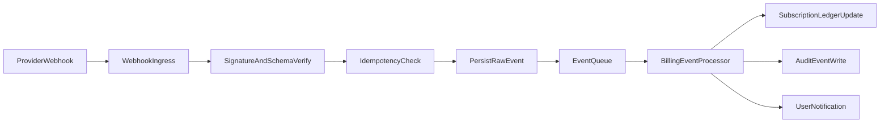

# VPN Billing Orchestration and Webhook Reliability

Date: 2026-04-17
Status: MVP implementation spec

## 1. Provider Priority and Routing

- Primary: YooKassa (cards + SBP).
- Secondary: CloudPayments.
- Tertiary: T-Bank acquiring.
- Routing policy:
  - normal: primary only.
  - degradation trigger: error rate > 5% for 5 minutes -> switch to next provider.
  - manual override via admin emergency flag.

## 2. Core Domain Objects

- `checkout_sessions`
  - internal checkout intent and selected provider.
- `payment_orders`
  - immutable order id and amount/currency.
- `payment_attempts`
  - one row per provider attempt with state.
- `payment_webhook_events`
  - raw payload hash + signature verification result + processing status.
- `subscription_ledgers`
  - timeline of entitlement changes driven by payment outcomes.

## 3. Payment State Machine

- `initiated` -> `pending_provider` -> `authorized` -> `captured` -> `applied`.
- Failure tracks:
  - `provider_declined`.
  - `provider_timeout`.
  - `signature_invalid`.
  - `reconciled_correction`.

Transition to active subscription only from `captured` and verified webhook/event pull.

## 4. API Contracts

- `POST /v1/billing/checkout`
  - request: user id (auth), plan id, preferred method.
  - response: hosted payment link and checkout session id.
- `POST /v1/billing/webhook/yookassa`
- `POST /v1/billing/webhook/cloudpayments`
- `POST /v1/billing/webhook/tbank`
- `POST /v1/billing/reconcile/run` (admin-only)
- `GET /v1/billing/subscription/status`

## 5. Webhook Processing Pipeline

## 6. Idempotency and Anti-Replay Rules

- Unique constraint `(provider, provider_event_id)` on `payment_webhook_events`.
- Additional payload hash check to detect provider re-sends with altered body.
- Accept webhook only within configured timestamp skew window.
- HMAC/PKI signature verification mandatory before any state mutation.
- Side effects executed via outbox workers:
  - subscription updates.
  - notifications.
  - analytics events.

## 7. Reconciliation Strategy

- Daily job:
  - pull settlements from all providers.
  - compare with internal `payment_orders` and `payment_attempts`.
  - mark discrepancies with severity and owner.
- Hourly lightweight check:
  - identify stale `pending_provider` > 15 min.
  - trigger status poll API to provider.

## 8. Retry and Fallback Policy

- Checkout creation retry:
  - exponential backoff: 2s, 5s, 10s.
  - max 3 tries per provider before switching.
- Webhook processing retry:
  - queue retry up to 10 attempts with dead-letter queue.
- Provider outage:
  - auto-switch checkout generation to next provider.
  - show real-time banner in cabinet about temporary method limitations.

## 9. Refunds and Chargebacks

- Support full and partial refund endpoints in billing admin API.
- Chargeback handling:
  - mark subscription `restricted_pending_review`.
  - retain access policy configurable (grace on first dispute, block on repeated abuse).
- All refund and chargeback actions must emit audit event with actor and reason.

## 10. Fraud and Abuse Baseline

- Signals:
  - repeated failed payments from multiple cards for one account.
  - high-velocity checkouts from one device fingerprint.
  - mismatch between account country and payment metadata risk score.
- Controls:
  - temporary checkout cooldown.
  - step-up auth before next payment attempt.
  - manual review queue for high-risk score.
