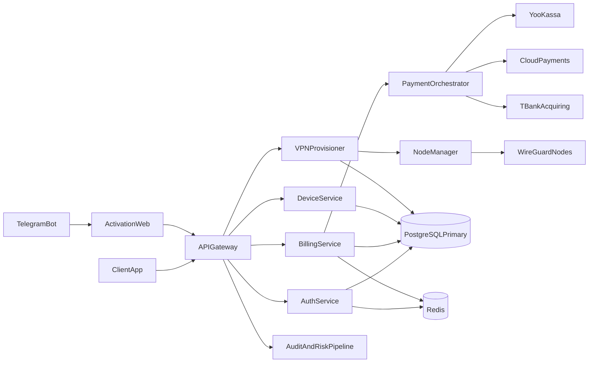

# VPN HLD/LLD and API Contracts (RF, Multi-Region)

Date: 2026-04-17
Status: Draft for implementation

## 1. Scope

- Product: commercial VPN with Telegram-assisted activation.
- Platforms: iOS, Android, macOS, Windows.
- Flow: Telegram deep-link -> web claim page -> manual import link into app -> connect.
- Payments: YooKassa primary, CloudPayments secondary, T-Bank tertiary.

## 2. High-Level Architecture (HLD)

## 3. Low-Level Architecture (LLD)

### 3.1 Services

- `AuthService`: account auth, refresh rotation, 2FA step-up, session revocation.
- `BillingService`: checkout sessions, payment webhooks, subscription state machine.
- `DeviceService`: device claim, device cap enforcement, revoke operations.
- `VPNProvisioner`: token validation, profile generation, key rotation, profile revocation.
- `TelegramActivation`: deep-link issuance/verification and binding with user identity.
- `AuditRiskPipeline`: immutable audit events and risk scoring feed.

### 3.2 Multi-Region Topology

- Regions:
  - `ru-central`: control-plane primary.
  - `eu-failover`: hot-standby control-plane.
  - `edge-regions`: VPN data-plane node pools.
- PostgreSQL:
  - primary in `ru-central`, async replica in `eu-failover`.
  - PITR backups, hourly snapshot + WAL archiving.
- Redis:
  - active/passive with sentinel or managed failover.
- Node provisioning:
  - region-local agent pulls signed config and reports health.

### 3.3 State Model

- `subscription_status`: `trial` -> `active` -> `grace` -> `past_due` -> `blocked` -> `canceled`.
- `device_status`: `pending_claim` -> `active` -> `revoked`.
- `vpn_profile_status`: `draft` -> `ready` -> `active` -> `revoked` -> `expired`.

## 4. Data Flow Contracts

### 4.1 Activation Flow

1. User initiates from bot with signed token.
2. Website exchanges token for short-lived claim token.
3. App submits manual link token to `import/validate`.
4. Backend validates subscription/device quota and issues profile.
5. App stores profile securely, enables connect button.

### 4.2 Connect Authorization

1. App requests `connect/authorize`.
2. Backend validates session, device status, active profile.
3. Returns short-lived tunnel authorization assertion (`<= 60s TTL`).

## 5. Entity Baseline

- `users(id, email, password_hash, mfa_enabled, created_at)`
- `sessions(id, user_id, refresh_hash, device_id, expires_at, revoked_at)`
- `subscriptions(id, user_id, plan_id, provider, status, renew_at, grace_until)`
- `payments(id, user_id, provider, order_id, amount, status, idempotency_key)`
- `payment_events(id, provider, event_id, event_hash, processed_at)`
- `devices(id, user_id, platform, fingerprint_hash, status, claimed_at, revoked_at)`
- `telegram_links(id, user_id, telegram_user_id, verified_at, last_nonce)`
- `device_claim_tokens(id, user_id, device_id, token_hash, expires_at, used_at)`
- `vpn_profiles(id, user_id, device_id, node_id, public_key, config_ref, status, expires_at)`
- `vpn_nodes(id, region, endpoint, status, capacity, health_score)`
- `audit_events(id, actor_id, action, entity, entity_id, payload_hash, created_at)`
- `risk_events(id, user_id, event_type, score, status, created_at)`

## 6. API Contracts (MVP)

### 6.1 Auth and Session

- `POST /v1/auth/login`
  - in: `email`, `password`, `device_context`
  - out: `access_token`, `refresh_token`, `requires_step_up`
- `POST /v1/auth/refresh`
- `POST /v1/auth/step-up/verify` (TOTP or telegram challenge)
- `POST /v1/auth/logout`

### 6.2 Telegram and Device Claim

- `POST /v1/tg/link/start`
  - out: signed URL for website claim.
- `POST /v1/tg/link/confirm`
  - binds telegram account to user.
- `POST /v1/device/link/create`
  - generates short-lived claim token.
- `POST /v1/device/claim`
  - activates device from claim token.
- `POST /v1/device/revoke`
  - revokes device and associated profiles.

### 6.3 Billing

- `POST /v1/billing/checkout`
- `POST /v1/billing/webhook/yookassa`
- `POST /v1/billing/webhook/cloudpayments`
- `POST /v1/billing/webhook/tbank`
- `POST /v1/billing/reconcile/run` (admin only)

### 6.4 VPN Profile

- `POST /v1/vpn/profile/import/validate`
  - in: manual import token/URL
  - out: profile metadata and readiness status.
- `POST /v1/vpn/profile/generate`
  - issues WireGuard profile for claimed device.
- `POST /v1/vpn/connect/authorize`
- `POST /v1/vpn/profile/revoke`

## 7. Non-Functional Targets

- Auth and critical APIs: p95 < 250 ms in primary region.
- Webhook processing: acknowledgement < 2 s, eventual consistency < 60 s.
- Control-plane availability: 99.95%.
- Audit trail write success: 99.99% with retry queue.
