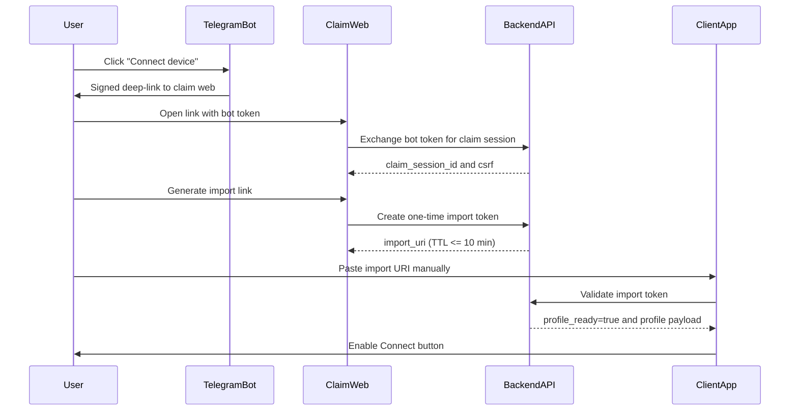

# Telegram -> Web -> App Device Claim Flow

Date: 2026-04-17
Status: Approved implementation flow for MVP

## 1. Product Requirement

- Telegram provides entry point.
- User opens web page from bot link.
- Web page issues import link/token.
- User pastes link manually into app.
- Connect button remains disabled until profile claim is valid.

## 2. End-to-End Sequence

## 3. Token Types

- `tg_entry_token`
  - signed by backend, passed from bot to web.
  - TTL: 5 minutes.
  - one-time nonce.
- `device_claim_token`
  - created from authenticated claim session.
  - TTL: 10 minutes.
  - bound to user id + platform + fingerprint hash.
- `connect_assertion`
  - short-lived authorization for connect action.
  - TTL: 60 seconds.

## 4. Validation Rules

- Token is accepted only if:
  - signature valid.
  - nonce not used before.
  - not expired.
  - user has active subscription.
  - device count under plan limit.
- On successful import:
  - mark token `used_at`.
  - issue/attach VPN profile for device.
  - append audit event.

## 5. API Endpoints

- `POST /v1/tg/link/start`
  - input: telegram context and authenticated user session.
  - output: signed URL for claim page.
- `POST /v1/device/link/create`
  - input: claim session, platform metadata.
  - output: one-time `import_uri`.
- `POST /v1/vpn/profile/import/validate`
  - input: import URI and local device context.
  - output: `ready`, profile metadata, expiry.
- `POST /v1/vpn/connect/authorize`
  - input: active session and profile id.
  - output: short-lived connect assertion.

## 6. Security and Abuse Controls

- Strict one-time semantics for all claim/import tokens.
- Per-account cap on link generation (example: 5 per hour).
- Per-IP cap on token validation attempts (example: 30 per hour).
- Bind import token to expected platform family.
- Optional step-up challenge if risk score is high.

## 7. UX and Error Handling

- App states:
  - `no_link` -> `validating` -> `ready` -> `connected`.
- User-friendly error classes:
  - `LINK_EXPIRED` -> request a new link in Telegram.
  - `LINK_ALREADY_USED` -> generate another link.
  - `SUBSCRIPTION_INACTIVE` -> renew payment.
  - `DEVICE_LIMIT_REACHED` -> revoke a device from cabinet.
- Never reveal sensitive validation details in UI text.

## 8. Audit Events Required

- `tg_link_started`
- `claim_session_opened`
- `import_token_issued`
- `import_token_validated`
- `vpn_profile_assigned`
- `connect_authorized`
- `device_revoked`

## 9. Implementation Checklist

- Backend:
  - token issuance and signature module.
  - claim session persistence.
  - device/profile entitlement checks.
- Web:
  - claim page and import link generation UI.
  - anti-CSRF and strict content-security-policy.
- App:
  - manual import field and validation call.
  - connect button gating by `ready` state.
  - secure storage of imported profile data.
